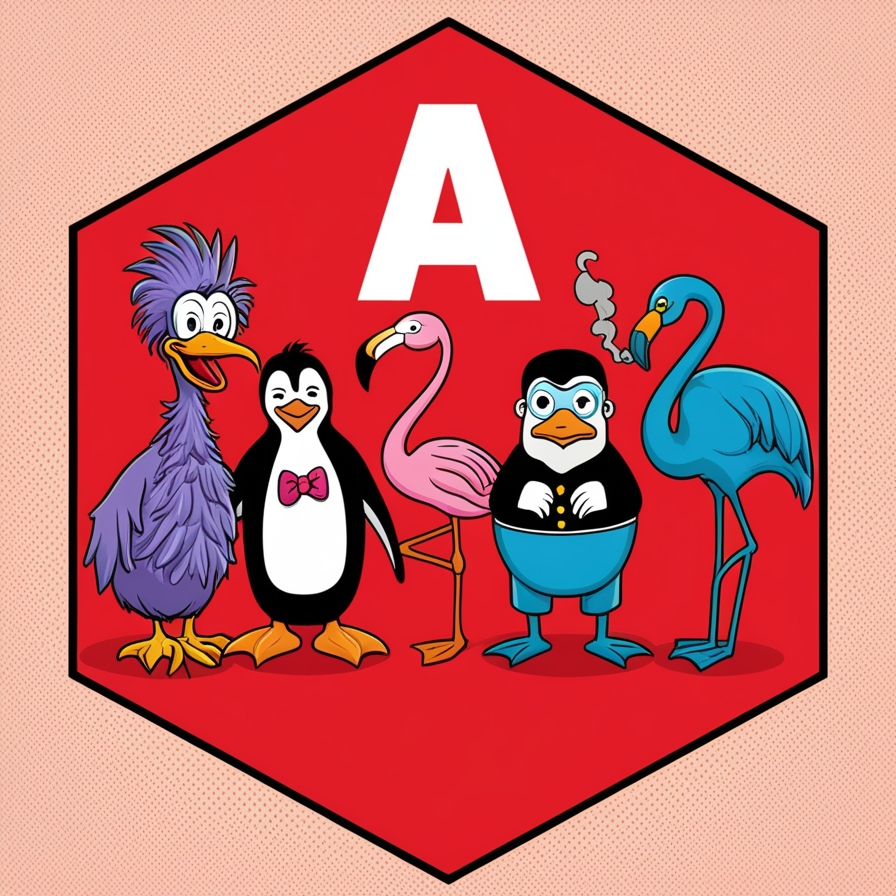

> Matthew 5
>
> [43] Ye have heard that it hath been said, Thou shalt love thy neighbour, and hate thine enemy. [44] But I say unto you, Love your enemies, bless them that curse you, do good to them that hate you, and pray for them which despitefully use you, and persecute you; [45] that ye may be the children of your Father which is in heaven: **for he maketh his sun to rise on the evil and on the good, and sendeth rain on the just and on the unjust.**

# Belomonte
Not released yet
If you code using this lib you [automatically become a cypherpunk](https://cdn.nakamotoinstitute.org/docs/cypherpunk-manifesto.txt).

## Bring your project to Nostr

This libraries will help you to use nostr protocol with angular.

- [Nostr NGX](./projects/nostr-ngx/README.md)
- [Nostr GUI NGX](./projects/nostr-gui-ngx/README.md)

## Release
Not released yet